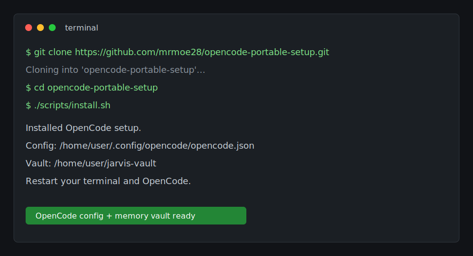
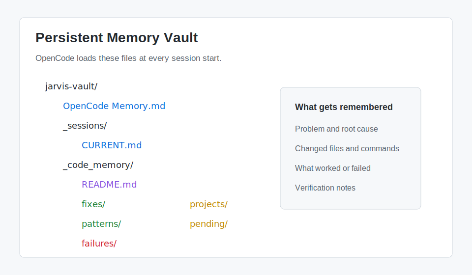
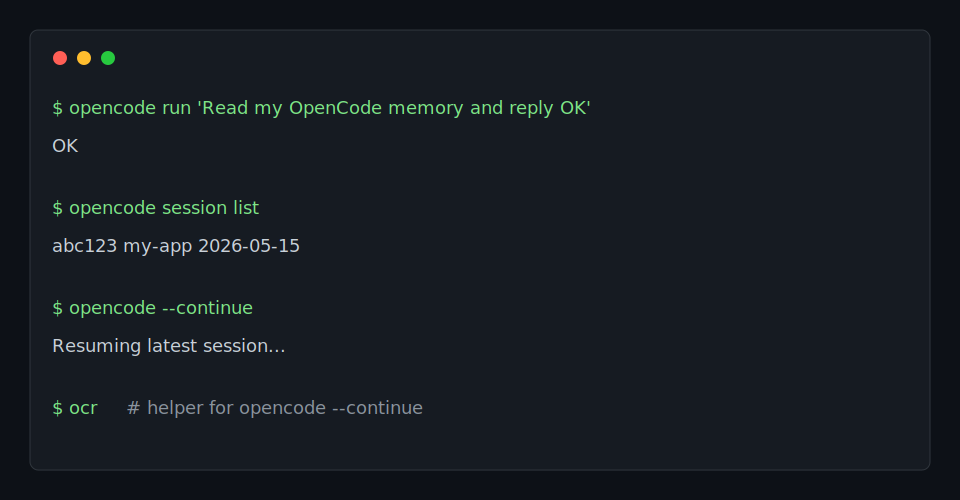

# OpenCode Portable Setup

Recreate the OpenCode setup used on this machine: global memory, code-memory notes, LSP, automatic pending memory capture, and shell helpers.

## Screenshots

### Install Flow



### Memory Layout



### Resume Commands



## What This Sets Up

- OpenCode global config with:
  - Ollama LAN provider
  - LSP enabled
  - global memory files loaded every session
  - permission for the memory vault path
- Persistent memory vault:
  - `OpenCode Memory.md`
  - `_sessions/CURRENT.md`
  - `_code_memory/{fixes,patterns,failures,projects,pending}`
- OpenCode plugin:
  - writes pending code-memory notes when a session becomes idle
- Optional shell helpers:
  - `oc`
  - `ocr`
  - `agent-auto`

## Quick Install

```bash
git clone https://github.com/mrmoe28/opencode-portable-setup.git
cd opencode-portable-setup
./scripts/install.sh
```

Default vault location:

```text
$HOME/jarvis-vault
```

Custom vault location:

```bash
VAULT_DIR="$HOME/Project X/jarvis-vault" ./scripts/install.sh
```

That custom command is the closest match to this desktop setup.

Custom Ollama endpoint:

```bash
OLLAMA_BASE_URL="http://ollama.lan:11434/v1" ./scripts/install.sh
```

Use both if your laptop should match this machine exactly:

```bash
VAULT_DIR="$HOME/Project X/jarvis-vault" \
OLLAMA_BASE_URL="http://ollama.lan:11434/v1" \
./scripts/install.sh
```

## After Install

Restart your terminal and OpenCode.

Verify:

```bash
opencode run 'Read my OpenCode memory and reply OK'
```

List sessions:

```bash
opencode session list
```

Resume last session:

```bash
opencode --continue
```

Or with the helper:

```bash
ocr
```

## LSP Setup

This setup enables LSP in OpenCode, but language servers still need to exist.

Install common servers:

```bash
npm install -g pyright bash-language-server typescript typescript-language-server
```

For Go:

```bash
sudo apt-get install -y golang-go
go install golang.org/x/tools/gopls@latest
```

Make sure Go user binaries are on PATH:

```bash
export PATH="$HOME/go/bin:$PATH"
```

## Memory Workflow

OpenCode loads the vault every session. It should:

- read `_sessions/CURRENT.md` at startup
- consult `_code_memory` before coding tasks
- write durable notes after fixes
- write or convert pending notes into:
  - `_code_memory/fixes`
  - `_code_memory/patterns`
  - `_code_memory/failures`

This is retrieval memory, not model training. It makes future sessions smarter by giving OpenCode a searchable record of what worked and what failed.
